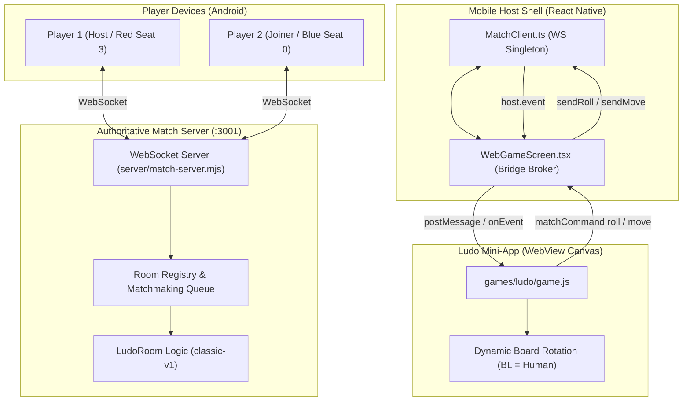

# Aura Ludo — Multiplayer & Networking Guide

This guide details the complete authoritative multiplayer implementation for **Aura Ludo**, including server setup, network protocol, board rotation geometry, Host SDK integration, and testing.

---

## 1. Architectural Overview

Aura Ludo adheres to a strict separation of trust:
1. **The Game Client (WebView)** is untrusted: it renders the board, animates movement, plays WebAudio SFX, and captures player touch input.
2. **The Host (React Native)** owns wallet connection, escrow staking, navigation, and WebSocket routing via the **Host SDK bridge**.
3. **The Match Server (Node.js WebSocket)** is the authoritative source of truth: it generates random dice rolls, calculates legal moves, verifies captures, enforces bonuses/penalties, and decides victory.



---

## 2. Match Server Quick Start

### Running the Server
The match server is a lightweight standalone Node.js process using `ws`:

```bash
# From workspace root
npm run match-server

# Or directly with node:
node server/match-server.mjs
```

The server binds to port **3001** by default (configurable via `PORT` environment variable).

### Health Check
You can verify the server is running by querying its HTTP endpoint:

```bash
curl http://localhost:3001/
```

**Response:**
```json
{
  "name": "aura-match-server",
  "status": "healthy",
  "roomsCount": 0,
  "queuedRandom": 0
}
```

---

## 3. Authoritative Rules (`classic-v1`)

The match server enforces the rules defined in [`docs/LUDO_RULEBOOK.md`](./LUDO_RULEBOOK.md):

| Rule | Implementation |
|---|---|
| **Board Track** | 52 main track cells (`0..51`), 5 home column cells (`52..56`), and home finish (`57`). |
| **Yard Exit** | Requires rolling a **6** to enter the player's painted start cell (progress `0`). |
| **Safe Cells** | 8 cells: starts (`4, 17, 30, 43`) and star cells (`12, 25, 38, 51`). Tokens on safe cells cannot be captured. |
| **Captures** | Landing on a non-safe cell occupied by an opponent sends that opponent's piece back to their yard (`-1`). |
| **Bonus Turn** | Rolling a 6, capturing an opponent token, or reaching home awards exactly **one** bonus roll. |
| **Three Sixes Penalty** | Rolling 3 consecutive sixes forfeits the turn immediately. |
| **Win Condition** | First player to move all 4 pieces to `FINISH` (progress `57`) wins. |

### Seat Allocations
- **2-Player (1v1)**:
  - **Seat 3 (Red)**: Start cell 43
  - **Seat 0 (Blue)**: Start cell 17
  - Distance: `(17 - 43 + 52) % 52 = 26` cells — **exactly halfway** across the 52-cell track.
- **4-Player**:
  - `[3, 2, 0, 1]` (Red $\to$ Green $\to$ Blue $\to$ Yellow clockwise).

---

## 4. Screen Geometry & Board Rotation

Per Lex's UX requirement, **the local human player must always sit at the Bottom-Left (BL) corner**, regardless of seat assignment.

### Rotation Mapping (`ROT_FOR_SEAT`)
In the original unrotated paint layout:
- Blue (0) is Top-Left (TL)
- Yellow (1) is Top-Right (TR)
- Green (2) is Bottom-Left (BL)
- Red (3) is Bottom-Right (BR)

Applying counter-clockwise (CCW) 90° rotations shifts corners:
`TL → BL → BR → TR → TL`.

Therefore, the number of CCW quarter-turns to rotate any seat to `BL` is:
```javascript
const ROT_FOR_SEAT = {
  0: 1, // Blue (TL)  + 1 CCW  = BL
  1: 2, // Yellow (TR) + 2 CCW  = BL
  2: 0, // Green (BL) + 0 CCW  = BL
  3: 3  // Red (BR)   + 3 CCW  = BL
};
```

### Canvas Hit-Testing Transforms
In [`games/ludo/game.js`](file:///Users/lex-work/aura/games/ludo/game.js):
```javascript
function toScreen(x, y) {
  var rx = x - CX, ry = y - CY;
  for (var i = 0; i < VIEW_ROT; i++) {
    var nx = ry, ny = -rx;
    rx = nx; ry = ny;
  }
  return [CX + rx, CY + ry];
}

function fromScreen(x, y) {
  var rx = x - CX, ry = y - CY;
  for (var i = 0; i < VIEW_ROT; i++) {
    var nx = -ry, ny = rx;
    rx = nx; ry = ny;
  }
  return [CX + rx, CY + ry];
}
```

### Dynamic Seat UI Setup (`setupSeats`)
Corner seats are dynamically bound:
- The human player's corner displays **"You"** and activates outline rings.
- Opponent corners display player initials and colors.
- In 2-player mode, unused corners (Green & Yellow) are hidden with `display: none`.
- Pieces for inactive seats are skipped in `drawPieces()`.

---

## 5. Network Message Protocol

Communication between the React Native host and the WebSocket match server:

### Outgoing Client Messages

#### 1. Create Room
```json
{
  "type": "room.create",
  "roomCode": "LUDO-4821",
  "mode": "2p",
  "playerName": "Alice"
}
```

#### 2. Join Room
```json
{
  "type": "room.join",
  "roomCode": "LUDO-4821",
  "playerName": "Bob"
}
```

#### 3. Random Match Queue
```json
{
  "type": "room.random",
  "playerName": "Charlie"
}
```

#### 4. Roll Dice
```json
{
  "type": "game.roll"
}
```

#### 5. Move Piece
```json
{
  "type": "game.move",
  "pieceIndex": 0
}
```

#### 6. Leave Room
```json
{
  "type": "room.leave"
}
```

---

### Incoming Server Broadcasts

#### 1. Match Started (`match.started`)
Sent when all seats are filled:
```json
{
  "type": "match.started",
  "roomCode": "LUDO-4821",
  "seats": [3, 0],
  "yourSeat": 3,
  "currentSeat": 3,
  "state": {
    "pieces": [[-1,-1,-1,-1], [-1,-1,-1,-1], [-1,-1,-1,-1], [-1,-1,-1,-1]],
    "status": "playing"
  }
}
```

#### 2. Die Rolled (`die.rolled`)
Broadcast when a player rolls:
```json
{
  "type": "die.rolled",
  "seat": 3,
  "value": 6,
  "sixStreak": 1,
  "legalMoves": [
    { "seat": 3, "idx": 0, "from": -1, "to": 0 },
    { "seat": 3, "idx": 1, "from": -1, "to": 0 }
  ],
  "forfeited": false
}
```

#### 3. Piece Moved (`piece.moved`)
Broadcast when a move is executed:
```json
{
  "type": "piece.moved",
  "seat": 3,
  "pieceIndex": 0,
  "from": -1,
  "to": 0,
  "captured": 0,
  "homed": false
}
```

#### 4. Turn Changed (`turn.changed`)
Broadcast when the turn passes to another player or a bonus roll is awarded:
```json
{
  "type": "turn.changed",
  "currentSeat": 0,
  "extraTurn": false
}
```

#### 5. Match Completed (`match.completed`)
Broadcast when a player wins or an opponent disconnects:
```json
{
  "type": "match.completed",
  "winner": 3,
  "reason": "all_tokens_home"
}
```

---

## 6. Host SDK Bridge Details

In [`mobile/src/runtime/WebGameScreen.tsx`](file:///Users/lex-work/aura/mobile/src/runtime/WebGameScreen.tsx):

1. **Injected Bridge API**:
   - `window.AuraHost.onEvent(callback)`: Registers a listener for push events from the host.
   - `window.AuraHost.matchCommand({ type: "roll" })`: Sends a roll command.
   - `window.AuraHost.matchCommand({ type: "move", pieceIndex })`: Sends a move command.
   - `window.AuraHost.matchGet()`: Retrieves the initial match state and assigned seat.

2. **Event Dispatching**:
   Incoming WebSocket messages on `MatchClient` are forwarded into the WebView:
   ```typescript
   const emitHostEvent = useCallback((event: string, payload: any) => {
     const js = `window.dispatchEvent(new MessageEvent('message', {
       data: JSON.stringify({ type: "host.event", event, payload })
     }));true;`;
     webRef.current?.injectJavaScript(js);
   }, []);
   ```

---

## 7. Testing & Verification

### Automated Rule Checks
```bash
node server/test-room.mjs
```
Verifies seat allocation, start cell math, and safe cell sets.

### End-to-End Simulation
```bash
node server/test-multiplayer-sim.mjs
```
Simulates a complete 2-player match lifecycle: room creation, roll-6 yard entry, safe cell protection, track collision captures, and home progression.

### TypeScript Compilation
```bash
./mobile/node_modules/.bin/tsc --noEmit -p mobile/tsconfig.json
```
Ensures 100% type safety across React Native and MatchClient code.

### Rebuilding the Ludo Bundle
Whenever `games/ludo/game.js`, `style.css`, or `index.html` are modified, regenerate the bundle:
```bash
node scripts/pack-ludo.mjs
```

---

## 8. Android Emulator Networking Note

When running on an Android Emulator:
- The emulator accesses the host machine's `localhost` via IP **`10.0.2.2`**.
- `MatchClient.ts` automatically switches the server URL to `ws://10.0.2.2:3001` on the Android Emulator (and uses the Mac's network address on a real phone).

